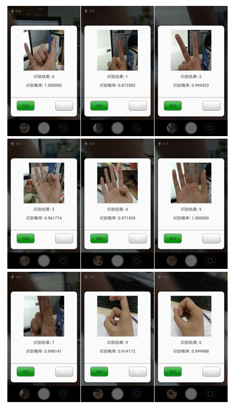
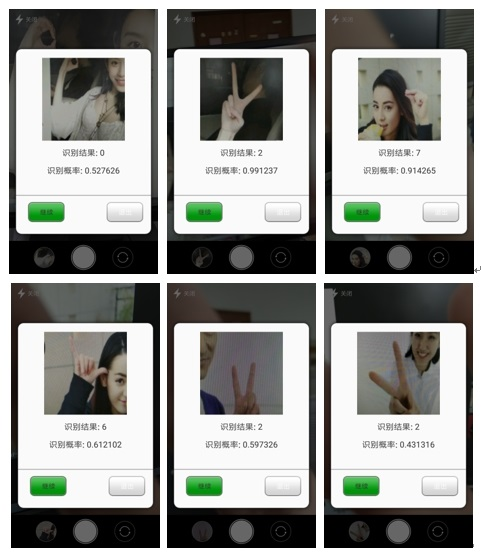
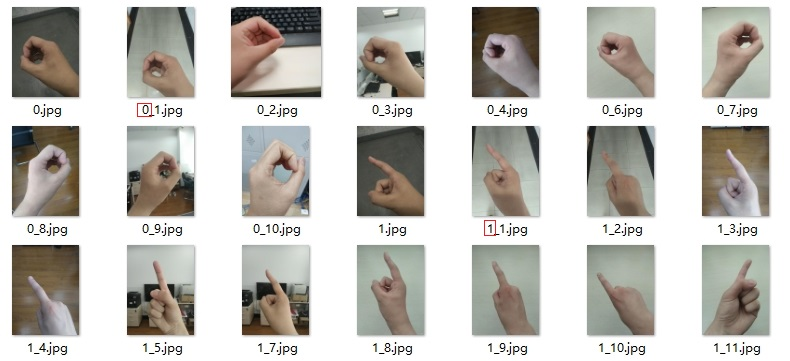

中文 &#124; [English](https://github.com/tz28/Chinese-number-gestures-recognition/blob/master/README.en-US.md)
# Chinese-number-gestures-recognition
Chinese number gestures recognition app（数字手势识别APP，识别0-10）

# 基于卷积神经网络的数字手势识别APP（安卓）

## 1、项目简介
这是一个基于卷积神经网络的数字手势识别APP（安卓），主要功能为：通过手机摄像头识别做出的数字手势，能够识别数字0, 1, 2, 3, 4, 5, 6, 7, 8, 9, 10 对应的手势。

Chinese-number-gestures-recognition项目下包含两块代码：1. DigitalGestureRecognition为安卓APP代码；2. digital_gesture_recognition为PC端处理数据及训练模型代码，编程语言为python。

开发环境：

PC端：python3.6, TensorFlow-gpu1.8, keras2.1.6, PIL，硬件NVIDIA GTX1070, 16GB momery

APP端：Android studio3.1.2, TensorFlow Lite, opencv-3.4.0-android-sdk

## 2、APP识别结果演示

### 2.1、白天场景


### 2.2、夜间场景


### 2.3、复杂场景（正确率较低，碰运气...仅仅是会心一笑，只是好奇试一试）



## 3、数据集
### 3.1、原始数据集

地址：https://pan.baidu.com/s/1whTtvo6GjIFbfKTYXzTZgQ 

该数据集共215张数字手势图片，该数据集由我的朋友们自己拍照，感谢他们的帮助。每张图片对应的标签已标记在图片的命名中，图片命名格式为：标签_编号。例如：



 ***数据集还是太少了，因此，有奉献精神的同学，可以把您拍到的照片放到 collect_picture 文件下，命名规则参照上面的命名，原则上，命名只要保证 “标签_”即可，“_”后面随意。***


### 3.2、数据增强（data augmentation）后的数据集

地址：https://pan.baidu.com/s/1_tLq_HcSmI1kg7VY9pnG5g

原始图片通过平移，拉伸，旋转等操作，每张图片生成100张，使用的生成代码为 digital_gesture_recognition/data_augmentation.py。故生成后的数据集共21592张图片。

**NOTE:** 该数据集大小为11.6GB，压缩后约11GB。如果您的网络带宽下载速度较慢，可以使用原始数据集和digital_gesture_recognition/data_augmentation.py自己重新生成。

### 3.3、压缩后的数据集

把每张图片缩放到64*64大小，形成的数据集为：digital_gesture_recognition/resized_img，共21592张图片，采用的压缩算法为TensorFlow中area interpolation。digital_gesture_recognition/resized_img_split数据集和resized_img是相同的，只是分割成了10个小文件夹。

### 3.4、H5数据集

地址：https://pan.baidu.com/s/1COV1UVM37X7jueg3wGfXWw

此h5数据集由resized_img中图片转化为h5文件得来。此数据集的大小为：21592*64*64*3，您可以使用 **h5py** 库来对此数据集进行操作。比如，你可以使用如下语句来载入数据集：

```python
data = h5py.File("dataset//data.h5","r")
X_data = np.array(data['X']) #data['X']是h5py._hl.dataset.Dataset类型，转化为array
Y_data = np.array(data['Y'])
```
## 4、训练好的模型

digital_gesture_recognition/model_200中为epoch=200训练得到的模型，也是APP中使用的模型，model_2500 则为epoch=2500训练的模型。在PC端训练得到的模型在训练集、测试集上的accuracy分别为：99.8%和99.5%。在APP上因为面临的环境更加复杂，准确率远没有达到这个数字。在PC端随机测试几张好友拍的照片（在训练集、测试集中均没有出现过），测试结果比较满意，测试结果如下：


## 5、Android Studio环境的配置

将训练好的模型迁移到Android Studio中，教程见本人博客：https://blog.csdn.net/u012328159/article/details/81101074

在Android studio中配置OpenCV环境，参见本人博客：https://blog.csdn.net/u012328159/article/details/81094436

关于此项目其它的介绍，请参见本人博客：https://blog.csdn.net/u012328159/article/details/81123018

注：APP中相机部分使用了CHNicelee的代码，地址：https://github.com/CHNicelee/CameraDemo 感谢。CHNicelee关于此相机代码的博客地址：https://blog.csdn.net/q1242027878/article/details/78704837

